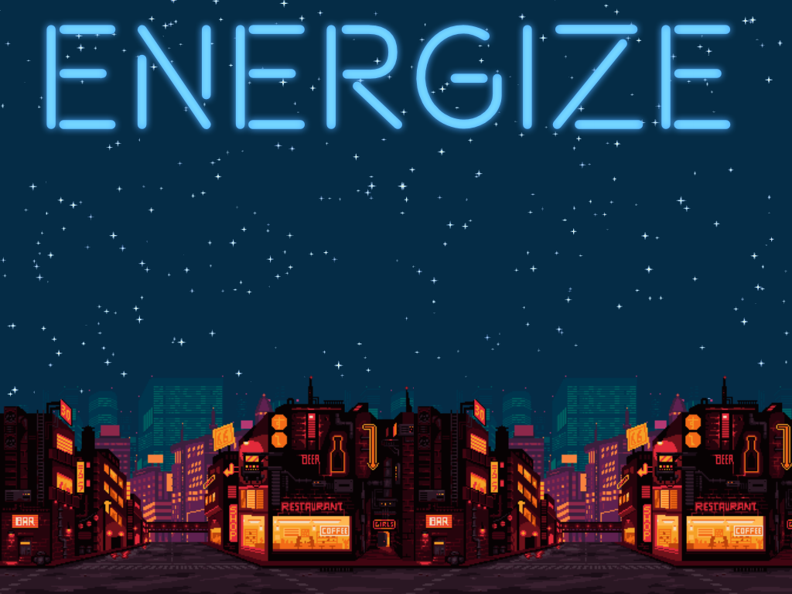

### A game by Jacob Allen and Matt Eden
###### Created for COMPSYS 302 at the University of Auckland

Energize is a side-scrolling action adventure game set in the far future. It follows the quest of the main character Otto and their journey to recover the McGuffin from Evil Bad Guy.

#### Compile instructions - Eclipse
1. On the top menu, click "File"  and choose "Open Projects from File System".
2. At "Import Source", click "Directory" and navigate to where you have extracted the project. Once this is done, simply click "Finish".
3. On the top menu, click "Project" and then from the drop down click "Properties".
4. On the left hand side of the menu, click "Java Build Path". Navigate to the tab named "Source" and ensure that both "2019-Java-Group34-master/resources" and "2019-Java-Group34-master/src" are listed. If not, click "Add Folder" and select both "src" and "resources". Once both folders are showing correctly, click "Apply".
5. On the left hand side of the menu, click "Run/Debug Settings". Then > New > Java Application > OK.
6. Name appropriately. Set Main class as Main-sample > OK > Apply.
7. File > Export > Java > Runnable JAR file.
8. Set Launch configuration to the configuration made in step 6.
9. Choose a name and location for the JAR file.
10. Ensure that "Extract required libraries into generated JAR" is selected underneath "Library handling".
11. Simply click "Finish", and you're ready to play!

#### Launch instructions
##### For single / local multiplayer:
Open a new Terminal window `CTRL + ALT + T` and enter the comand `java -jar <path>/2019-Java-Group34.jar`

##### For networked multiplayer:
On both the host and client computer run the comand `java -jar <path>/2019-Java-Group34.jar [<host_ip_address>][<port_number>]`.

`host_ip_address` Default value is localhost. For networked multiplayer run `hostname -I` on the host computer to find the ip address. 
-If there are multiple addresses displayed pick the one that only consists of numbers (usualy in the form 192.168.##.##).

`port_number` Default value is 4200. Only change this if receiving `*There is already a host at this address. Joining that game instead*` error message. Valid port numbers are from 1023 - 65535 but these are not guaranteed to be available.

On the host computer, click "Host Game". While on any connecting computers click "Join Game".

#### Requirements:
- Java 1.8. This can be checked by running `java -version` in terminal.
- For networked multiplayer, all devices wishing to connect to the same host game must be on the same network.
